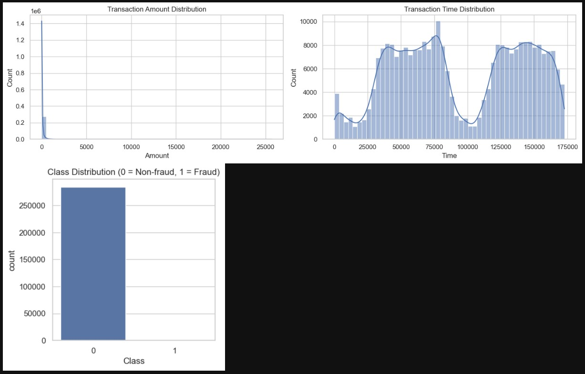
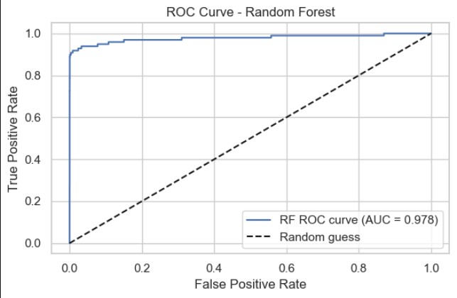
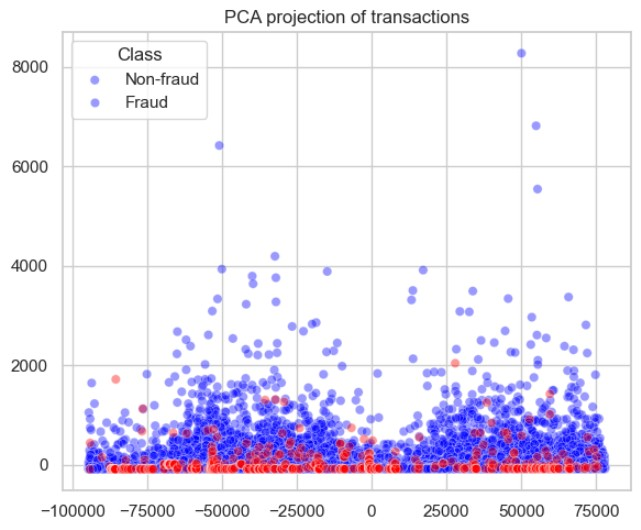

# Credit Card Fraud Detection using Machine Learning

This project focuses on detecting fraudulent credit card transactions using machine learning techniques on a highly imbalanced real-world dataset.

## Project Walkthrough
1. Load and explore the dataset
2. Perform EDA to understand imbalance
3. Preprocess data and scale features
4. Handle class imbalance using SMOTE and under-sampling
5. Train Logistic Regression and Random Forest models
6. Tune Random Forest using RandomizedSearchCV
7. Evaluate using ROC-AUC and Precision–Recall metrics
8. Visualize fraud patterns using PCA

## Dataset
- Kaggle Credit Card Fraud Dataset
- ~284,000 transactions
- 31 features (V1–V28 are PCA-transformed)
- Target: Class (0 = Normal, 1 = Fraud)

## Problem
The dataset is extremely imbalanced (~0.17% fraud cases), making accuracy a misleading metric.

## Approach
- Exploratory Data Analysis (EDA)
- Feature scaling for Time and Amount
- Handling class imbalance using SMOTE and random under-sampling
- Model training and comparison:
  - Logistic Regression
  - Random Forest
- Hyperparameter tuning using RandomizedSearchCV
- Evaluation using:
  - Confusion Matrix
  - ROC-AUC
  - Precision–Recall Curve
- PCA visualization for fraud vs non-fraud patterns

## Results
- ROC-AUC ≈ 0.98
- High recall (~91%) for fraudulent transactions
- Strong precision–recall trade-off suitable for financial risk detection
- ## Visual Results

### Class Distribution


### ROC Curve


### Precision–Recall Curve


### PCA Visualization



## Tech Stack
- Python
- Pandas, NumPy
- Scikit-learn
- Imbalanced-learn
- Matplotlib, Seaborn

## How to Run
```bash
pip install -r requirements.txt
jupyter notebook main.ipynb


